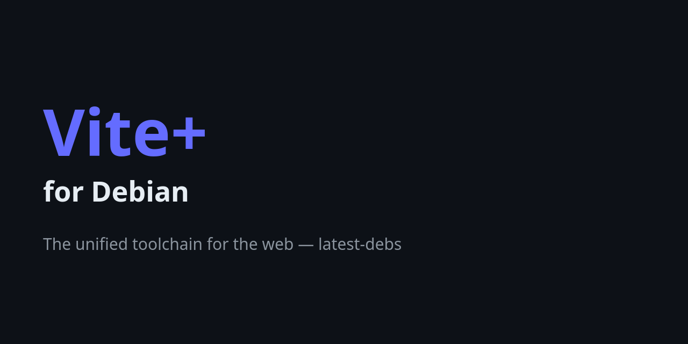

# Vite+ for Debian

[Vite+](https://viteplus.dev) — the unified toolchain for the web, behind the
`vp` CLI — packaged for Debian as part of
[latest-debs](https://github.com/latest-debs).

## Install

Via the latest-debs apt repository:

```sh
sudo extrepo enable latest-debs
sudo apt update
sudo apt install vite-plus
```

Or download a `.deb` from the [Releases](https://github.com/latest-debs/vite-plus-debian/releases) page:

```sh
sudo dpkg -i vite-plus_*.deb
```

## Supported distributions & architectures

- Debian Bookworm (12), Trixie (13), Forky (14/testing), Sid (unstable)
- amd64, arm64

  (Vite+'s upstream releases only publish amd64/arm64 Linux binaries)

## Notes

- This package installs the global `vp` CLI. The per-project `vite-plus` npm
  package and managed Node.js runtime are handled by `vp` itself.
- Vite+ is currently in beta (voidzero-dev/vite-plus).

## Disclaimer

Unofficial packaging only. For issues with Vite+ itself, see
[voidzero-dev/vite-plus](https://github.com/voidzero-dev/vite-plus).
